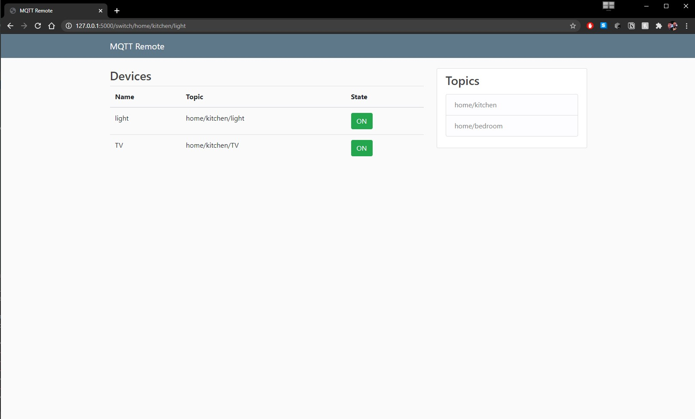

# Projekt: Pilot do smart home (MQTT)
## **Michał Kurleto**

## Instrukcja:
1. Należy uzupełnić w pliku config.json dane potrzebne do połączenia się ze swoim brokerem MQTT
2. Uruchomić plik app.py powinna się pokazać wiadomość:
```
* Serving Flask app "app.py"
 * Environment: development
 * Debug mode: off
 * Running on http://127.0.0.1:5000/ (Press CTRL+C to quit)
```
3. Należy uruchomić powyższy link w przeglądarce
4. Po włączeniu/wyłączeniu dowolnego użądzenia powinno się pokazać w konsoli coś w rodzaju:
```
[INCOMING MESSAGE] {'topic': 'home/bedroom/light', 'payload': 'OFF'}
```
Co oznacza że operacja dotarła do serwera MQTT i wróciła do nas bo subskrybujemy topic.

## Informacje
Project jest wykonany w oparciu o bibliotekę Flask oraz Flask-MQTT.   
Wszystkie pokoje i znajdujące się w nich urządzenia są ładowane dynamicznie na stronę z pliku config.json


## Przykład działania

